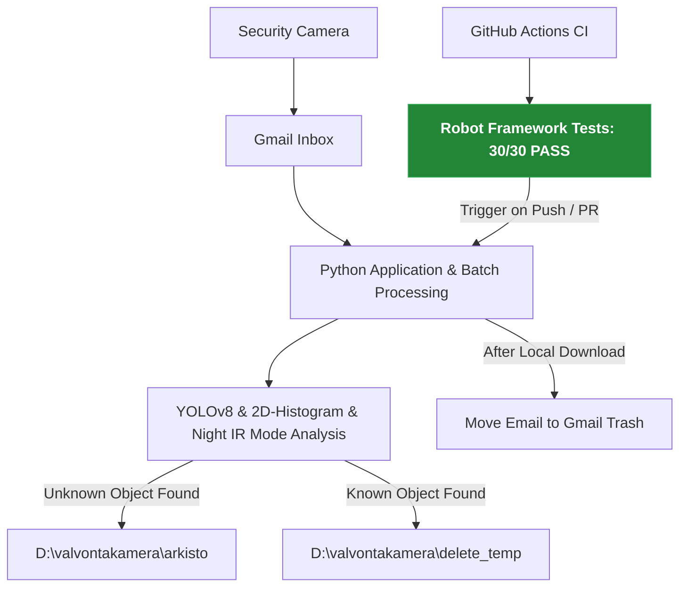

# smart_security_cleaner

## English

Smart Security Cleaner automates the processing of security camera emails and video attachments received in Gmail.

The application analyzes incoming messages, processes attached videos using an AI computer vision layer, archives critical alerts, or routes safe recordings into a local quarantine folder. This helps prevent Gmail storage from filling up with large security camera files.

The project is also used as a learning platform for:

* Python development (AI & Computer Vision)
* Robot Framework test automation
* GitHub Actions CI workflows
* Modern QA and automation practices

---

## 🛠️ Built With / Teknologiat
* **Languages:** Python
* **Computer Vision & AI:** YOLOv8, OpenCV (BGR2HSV, Color Histograms)
* **Automation & CI/CD:** GitHub Actions
* **Testing & QA:** Robot Framework
* **APIs:** Gmail API (OAuth2)

## Suomi

Smart Security Cleaner automatisoi Gmailiin saapuvien valvontakameraviestien ja videoiden käsittelyn.

Sovellus analysoi saapuvat sähköpostit, käsittelee videoliitteet älykkään tekoälykerroksen (AI/Konenäkö) avulla sekä arkistoi tai poistaa tarpeettoman materiaalin. Tavoitteena on estää Gmail-tilin täyttyminen suurista valvontakameravideoista ja vähentää manuaalisen käsittelyn tarvetta.

Projektia käytetään samalla oppimisprojektina seuraaviin aiheisiin:

* Python-kehitys (Tekoäly & Konenäkö)
* Robot Framework -testiautomaatio
* GitHub Actions CI -workflowt
* Modernit QA- ja automaatiokäytännöt

---

## Workflow / Työnkulku

---
## Features / Ominaisuudet

*   **Batch Processing Eräajo:** Käsittelee viestit tehokkaasti määritetyssä eräkoossa (koodi stressitestattu onnistuneesti 500 viestin eräajolla) säästääkseen Google API -kyselyrajoja (Rate Limiting).
*   **Multi-Layer AI Processing:** Hyödyntää YOLOv8-objektitunnistusta, OpenCV:n dynaamisia 2D-värihistogrammeja (BGR2HSV) sekä dynaamista infrapuna-yömooditunnistusta (Saturation-keskiarvon analyysi).
*   **Retention-based Quarantine Model:** Ohjaa turvalliset videot automaattisesti paikalliseen roskakoriin (`delete_temp`), josta taustapalvelu tuhoaa ne 30 päivän säilytysajan jälkeen.
*   **Automated Log Management:** Alustaa ja leimaa järjestelmän oman virhelokin (`error_log.txt`) automaattisesti jokaisen uuden ajokerran alussa aikaleimalla.
*   **Visual Debugging Tool (`katso_havainnot.py`):** Työkalu analyysin manuaaliseen jälkitarkistukseen. Ajaa videon uudelleen ja generoi erilliseen tarkistuskansioon kuvakaappaukset, joihin on piirretty bounding boxit ja tunnistetut luokat (esim. "Vieras auto", "Ihminen").
*   **MLOps Data Labeling (`sample_service.py`):** Puoliautomaattinen työkalu tekoälymallin opettamiseen ja datan korjaamiseen. Jos järjestelmä tekee virhetulkinnan (esim. luokittelee oman auton vieraaksi), työkalulla voidaan poimia videosta näytekuva Tensor-muunnoksilla ja tallentaa se suoraan oikeaan mallikuvakansioon jatko-opetusta varten.

---

## Retention / deletion model (Karanteeni- ja säilytysmalli)

*   **Critical / Unknown target** (Vieras ihminen/auto) ➔ `D:\valvontakamera\arkisto\` (Pysyvä tallennus)
*   **Safe / Known target** (Oma auto, asukas, oma koira) ➔ `D:\valvontakamera\delete_temp\` (Karanteeni)
*   **Final cleanup job** removes expired quarantine files after 30 days.

---
*Document updated: June 2026 - Features updated to match the production-ready YOLOv8 & IR-Night mode architecture.*
