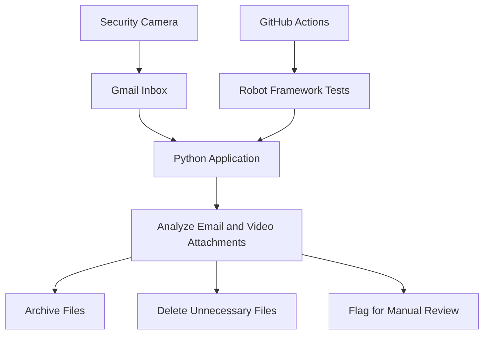

# smart_security_cleaner

## English

Smart Security Cleaner automates the processing of security camera emails and video attachments received in Gmail.

The application analyzes incoming messages, processes attached videos, archives or removes unnecessary material, and helps prevent Gmail storage from filling up with large security camera files.

The project is also used as a learning platform for:

* Python development
* Robot Framework test automation
* GitHub Actions CI workflows
* Modern QA and automation practices

---

## Suomi

Smart Security Cleaner automatisoi Gmailiin saapuvien valvontakameraviestien ja videoiden käsittelyn.

Sovellus analysoi saapuvat sähköpostit, käsittelee videoliitteet sekä arkistoi tai poistaa tarpeettoman materiaalin. Tavoitteena on estää Gmail-tilin täyttyminen suurista valvontakameravideoista ja vähentää manuaalisen käsittelyn tarvetta.

Projektia käytetään samalla oppimisprojektina seuraaviin aiheisiin:

* Python-kehitys
* Robot Framework -testiautomaatio
* GitHub Actions CI -workflowt
* Modernit QA- ja automaatiokäytännöt

---

## Workflow

## Planned features

* Implement retention-based quarantine folder for deleted videos
* Add configurable retention period (e.g. 7–30 days)
* Improve email filtering rules
* Expand logging and monitoring

---

## Retention / deletion model (future improvement)

* Safe video → Archive
* Uncertain video → Review folder
* Unwanted video → Quarantine (retained X days)
* Final cleanup job removes expired quarantine files