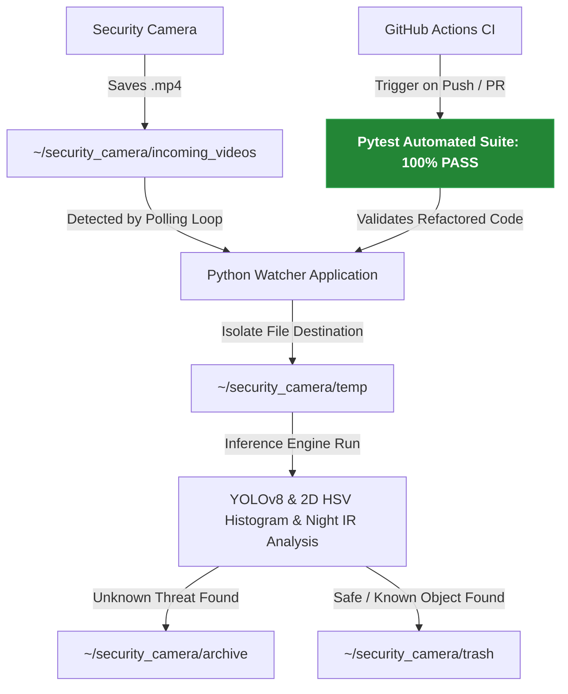

# 🛡️ Smart Security Camera System & Real-Time AI Watcher (`smart_security_cleaner`)

This application automates the management, AI analysis, and cleanup of security camera video files. The system continuously watches a local directory for incoming camera feeds, analyzes them in real-time using computer vision (YOLOv8, Color Histograms, and Face Recognition), and automatically filters out videos containing only known residents, vehicles, or family pets.

The project also serves as a modern learning and development platform for:
* Python backend development (AI, Automation & Computer Vision)
* Automated Unit Testing with **Pytest** and fixtures
* GitHub Actions Continuous Integration (CI) workflows
* Modern QA engineering and code refactoring practices

---

## 🛠️ Built With / Teknologiat
* **Core Language:** Python
* **Computer Vision & AI:** YOLOv8 (`ultralytics`), OpenCV (`cv2`), `face_recognition`, `numpy`
* **Testing & QA:** Pytest (utilizing local isolated environment fixtures)
* **Automation & CI/CD:** GitHub Actions Cloud Integration

---

## ⚙️ Workflow / Työnkulku

---

## 🚀 Key Features / Ominaisuudet

*   **Continuous Directory Watching:** Replaced legacy email pulling with a highly responsive file-system polling mechanism. It monitors the `incoming_videos` folder and triggers processing the moment a file becomes stable.
*   **Power Outage Recovery:** Built-in tolerance for system reboots and outages. At startup, the loop automatically fetches all existing backlogged videos and processes them sequentially from oldest to newest.
*   **Multi-Layer AI Processing:** Utilizes YOLOv8 for primary object classification, normalized 2D HSV color histograms for authorized vehicle/pet recognition, and custom aspect-ratio verification for black-and-white infrared night modes.
*   **Automated Midnight Log Rotation:** Integrated a robust logging system using Python's `TimedRotatingFileHandler`. It automatically creates a fresh log file every midnight and maintains a rolling 7-day storage window to prevent disk bloat.
*   **Interactive MLOps Training (`sample_service.py`):** An interactive CLI utility designed to easily build the local reference template database. It clips detected targets out of raw videos and crops them directly into authorized template folders.
*   **Visual Debugger Tool (`analyze_results.py`):** A standalone script used to manually re-analyze files inside the `ai_results` directory. It renders object tracking rectangles (`cv2.rectangle`) and bakes classification outcome text onto video frames.

---

## 📂 Storage & Retention Model / Säilytysmalli

All directories are resolved dynamically inside the user's home directory (`~/security_camera/`):

*   **Critical / Unknown Threat** *(Intruder, unrecognized vehicle, unknown animal)* ➔ `~/security_camera/archive/` *(Permanent storage)*
*   **Safe / Known Target** *(Resident face match, own car histogram match, own dog match)* ➔ `~/security_camera/trash/` *(Quarantine zone)*
*   **Automatic Maintenance:** Expired files inside the `trash` directory are automatically pruned after **30 days** of retention.

---
*Document updated: July 2026 - Major rewrite to document the transition from legacy batch email parsing to real-time directory polling, English refactor, daily rolling logging architecture, and Pytest QA integration.*
